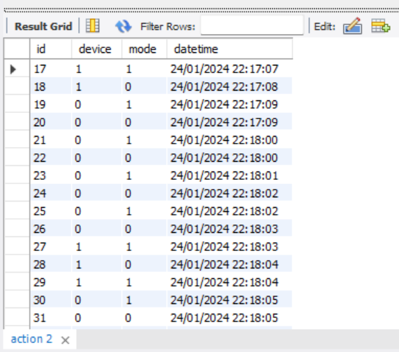

# BackendSoftwareIOT

Đây là Repo Backend bằng nodejs express kết nối với mysql DB, Backend này có chức năng insert, select data từ bảng action và sensor trong DB

## Cài Đặt

1. **Clone Repository:**

   
    git clone https://github.com/MinhDuHung/BackendSoftwareIOT.git

2. **Cấu Hình Environment:**

    Tạo một tệp `.env` trong thư mục gốc của dự án và cung cấp các biến môi trường cần thiết (ví dụ: PORT, DATABASE_URL, SECRET_KEY, ...).

3. **Chạy Ứng Dụng:**

    npm start

## Cấu Trúc Thư Mục

## Các Dependencies Chính

- **Express:** Framework web cho Node.js.
- **Mongoose:** Thư viện để tương tác với MongoDB.
- **Body-parser:** Middleware để xử lý dữ liệu đầu vào từ request.

## Routes

    - sensorRoutes: đây là route dành cho sensor api bao gồm các phương thức getAllSensors, insertSensor, handleSortingAscDesc
    - actionRoutes: đây là route dành cho sensor api bao gồm các phương thức getAllActions, insertAction,handleSortingAscDesc, handleSortingChosenOne

## Các Api ví dụ

## Dữ liệu mẫu
   - action table: 
   - sensor table: 